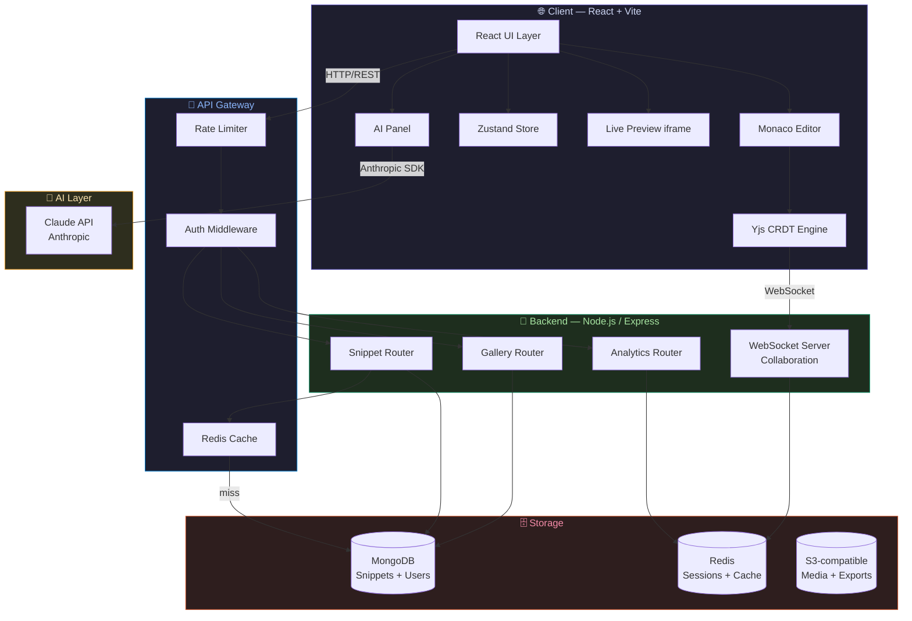
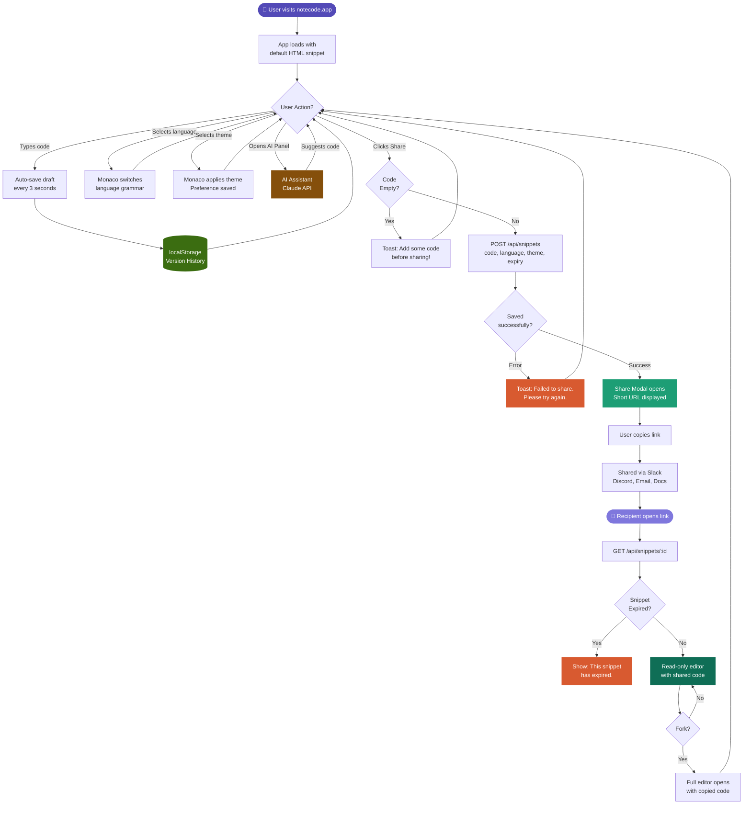
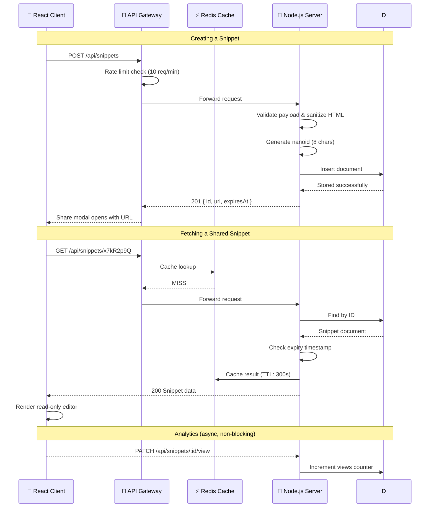
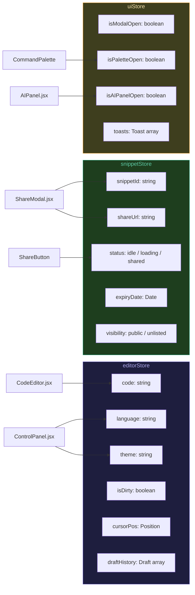
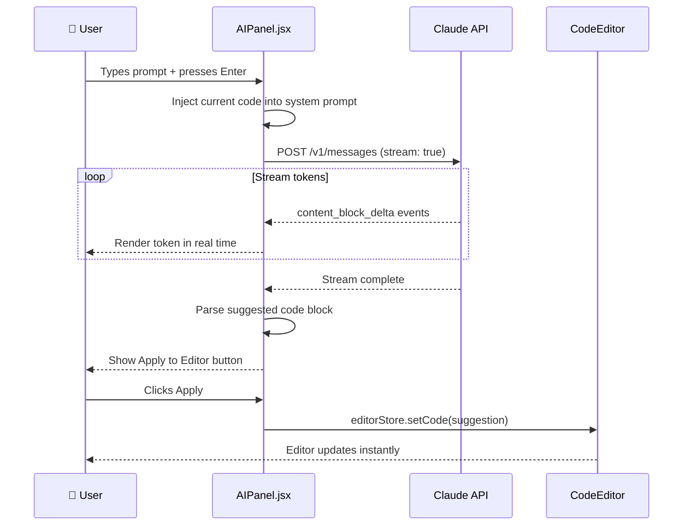
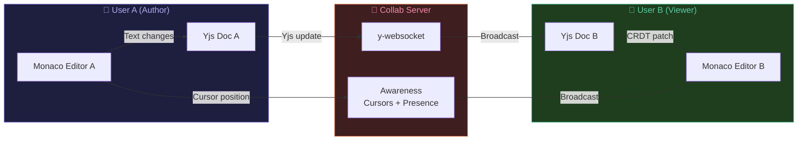
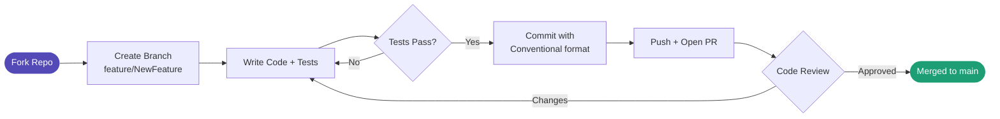
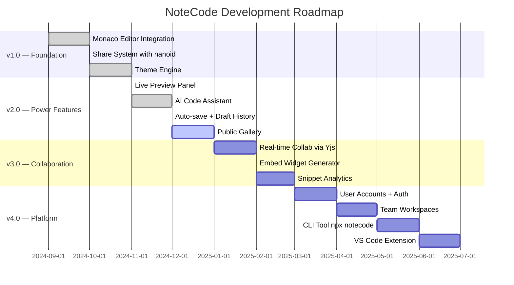

<<<<<<< HEAD
<div align="center">


<br/>


<br/><br/>


<br/><br/>


<br/><br/>

> ### 🚀 **NoteCode** is a lightning-fast, developer-friendly code sharing platform built with React + Monaco Editor.
> Write beautiful code in a VS Code-like environment, pick your theme, generate a unique link, and share it with anyone — in under 200ms.

<br/>

**[🌐 Live Demo](https://notecode.app)** &nbsp;·&nbsp; **[📖 Documentation](https://notecode.app/docs)** &nbsp;·&nbsp; **[🐛 Report Bug](https://github.com/yourusername/notecode/issues/new?template=bug_report.md)** &nbsp;·&nbsp; **[✨ Feature Request](https://github.com/yourusername/notecode/issues/new?template=feature_request.md)** &nbsp;·&nbsp; **[💬 Discussions](https://github.com/yourusername/notecode/discussions)**

</div>

---

## 📚 Table of Contents

- [📸 App Preview](#-app-preview)
- [💡 About The Project](#-about-the-project)
- [✨ Features](#-features)
- [🏗️ System Architecture](#%EF%B8%8F-system-architecture)
- [🔄 User Flow](#-user-flow)
- [🧩 Component Architecture](#-component-architecture)
- [🔌 API Reference](#-api-reference)
- [🗄️ State Management](#%EF%B8%8F-state-management)
- [📁 Project Structure](#-project-structure)
- [🚀 Getting Started](#-getting-started)
- [⚙️ Configuration](#%EF%B8%8F-configuration)
- [🎨 Themes & Languages](#-themes--languages)
- [⌨️ Keyboard Shortcuts](#%EF%B8%8F-keyboard-shortcuts)
- [🤖 AI Assistant Integration](#-ai-assistant-integration)
- [👥 Collaboration Feature](#-collaboration-feature)
- [📊 Analytics System](#-analytics-system)
- [🔒 Privacy & Expiry Controls](#-privacy--expiry-controls)
- [🌐 Public Gallery](#-public-gallery)
- [🛠️ Tech Stack](#%EF%B8%8F-tech-stack)
- [📦 Scripts](#-scripts)
- [🧪 Testing](#-testing)
- [🚢 Deployment](#-deployment)
- [🤝 Contributing](#-contributing)
- [🗺️ Roadmap](#%EF%B8%8F-roadmap)
- [📄 License](#-license)
- [📬 Contact & Support](#-contact--support)

---

## 📸 App Preview

<div align="center">

**🌙 Dark Mode — Editor + Live Preview**

```
╔══════════════════════════════════════════════════════════════════════════════════╗
║  ◉ NoteCode   [HTML ▾] [VS Dark ▾] [⌘K]          [AI ✦] [Share ⇗] [Copy 📋]  ║
╠═══════════════════════════════════════════╦════════════════════════════════════╣
║  EXPLORER          EDITOR                 ║         LIVE PREVIEW               ║
║  ┌────────────┐   1 │ <!DOCTYPE html>     ║  ┌──────────────────────────────┐  ║
║  │ 📄 index   │   2 │ <html lang="en">   ║  │                              │  ║
║  │ 📄 style   │   3 │   <head>           ║  │   ✦ Hello, NoteCode!         │  ║
║  │ 📄 main.js │   4 │     <meta...>      ║  │                              │  ║
║  └────────────┘   5 │     <title>...     ║  │   Beautiful code sharing     │  ║
║                   6 │   </head>          ║  │   for modern developers.     │  ║
║  OUTLINE          7 │   <body>           ║  │                              │  ║
║  ┌────────────┐   8 │     <h1>Hello      ║  └──────────────────────────────┘  ║
║  │ h1 Hello   │   9 │     </h1>          ║                                    ║
║  │ p  desc    │  10 │   </body>          ║  📊 Views: 1,284  ⭐ Stars: 42     ║
║  └────────────┘  11 │ </html>            ║  🔗 notecode.app/s/x7kR2p          ║
║                      │                   ║  🕐 Expires: 7 days                ║
╚═══════════════════════════════════════════╩════════════════════════════════════╝
║  🤖 AI: "Your code looks clean. Want me to add responsive styles?"  [Yes] [No] ║
╚══════════════════════════════════════════════════════════════════════════════════╝
```

**☀️ Light Mode — Read-Only Shared View**

```
╔══════════════════════════════════════════════════════════════════════╗
║  ◎ NoteCode                              [Fork 🍴] [Star ⭐] [···]  ║
╠══════════════════════════════════════════════════════════════════════╣
║  📄 shared by @devuser · Python · 3 days ago · 👁 892 views          ║
╠══════════════════════════════════════════════════════════════════════╣
║   1 │ def fibonacci(n):                                              ║
║   2 │     """Generate Fibonacci sequence up to n terms."""           ║
║   3 │     a, b = 0, 1                                               ║
║   4 │     for _ in range(n):                                         ║
║   5 │         yield a                                                ║
║   6 │         a, b = b, a + b                                        ║
║   7 │                                                                ║
║   8 │ print(list(fibonacci(10)))                                     ║
║       [READ ONLY — Fork to edit this snippet]                        ║
╚══════════════════════════════════════════════════════════════════════╝
```

</div>

---

## 💡 About The Project

NoteCode was born out of one frustration — **sharing code in chats, emails, and documents is painful.** Indentation breaks. Syntax highlighting disappears. Context is lost. Existing tools like Pastebin feel outdated, and GitHub Gist requires an account just to view.

**NoteCode solves this by being:**

- ⚡ **Instant** — No signup required. Open the app, paste your code, share.
- 🎨 **Beautiful** — Monaco Editor with 10+ themes. Your code looks exactly like it does in VS Code.
- 🔗 **Linkable** — Every snippet gets a short, unique URL in under 200ms.
- 🤖 **Smart** — Built-in AI assistant (Claude) to explain, refactor, or improve code inline.
- 👥 **Collaborative** — Real-time presence so you can pair-program on a shared snippet.
- 🌐 **Community-driven** — A public gallery to discover, star, and fork great snippets.

### 🎯 Who Is This For?

| Persona | Use Case |
|---------|---------|
| 👨‍💻 **Developers** | Share code in PRs, Slack, Discord, Stack Overflow answers |
| 🎓 **Students** | Submit homework, share solutions, ask for help |
| 👩‍🏫 **Teachers** | Create example snippets for students to fork and modify |
| 🧑‍💼 **Interview Candidates** | Live code in interviews with the interviewer watching in real time 

---

## ✨ Features

### ✍️ Code Editor

<details>
<summary><b>Monaco Editor Integration (click to expand)</b></summary>

NoteCode uses **Microsoft Monaco Editor** — the same editor that powers VS Code. This gives users a true professional editing experience right in the browser.

- **Syntax Highlighting** — Context-aware colorization for all supported languages
- **IntelliSense** — Code completion, parameter hints, quick info
- **Multi-cursor Editing** — `Alt+Click` to add cursors, `Ctrl+D` to select next match
- **Bracket Matching** — Auto-closes `{`, `[`, `(`, `"`, `'`
- **Code Folding** — Collapse functions, classes, or blocks
- **Minimap** — Full-document overview on the right side
- **Find & Replace** — `Ctrl+H` with regex support
- **Word Wrap** — Toggle with `Alt+Z`
- **Line Numbers** — Always visible, relative mode optional
- **Error Squiggles** — Real-time error detection for JS/TS
- **Format Document** — `Shift+Alt+F` to auto-format code

</details>

### 🎨 Themes & Customization

<details>
<summary><b>10+ Editor Themes (click to expand)</b></summary>

| Theme Name | Style | Best For |
|-----------|-------|---------|
| VS Dark | Dark, neutral | General purpose |
| VS Light | Light, clean | Presentations |
| Dracula | Dark, vibrant purple | Long coding sessions |
| Monokai | Dark, classic | JS / Python |
| GitHub Dark | Dark, GitHub-flavored | Code reviews |
| GitHub Light | Light, GitHub-flavored | Documentation |
| One Dark Pro | Dark, Atom-inspired | React / Node.js |
| Solarized Dark | Warm dark | Reduced eye strain |
| Solarized Light | Warm light | Outdoor use |
| Night Owl | Cool dark | Late night coding |

> Theme preference is **persisted to `localStorage`** — your choice survives page refreshes.

</details>

### 🔗 Share System

<details>
<summary><b>Smart Share Engine Details (click to expand)</b></summary>

- **nanoid** generates a cryptographically random 8-character ID (e.g., `x7kR2p9Q`)
- Share button is enabled on page load
- On click → `POST /api/snippets` is called → unique URL returned in `<200ms`
- Share button **auto-disables** after sharing to prevent duplicate POSTing
- Any keypress in the editor **re-enables** the share button
- Link is instantly copied to clipboard on modal open
- Toast notification confirms copy success or shows error

</details>

### 🤖 AI Code Assistant

<details>
<summary><b>Claude API Integration (click to expand)</b></summary>

Press `Cmd+Shift+A` to open the AI panel. The assistant has full context of your current code snippet and can:

- **Explain** — "What does this code do?" in plain English
- **Refactor** — Suggest cleaner, more readable versions
- **Debug** — Identify potential bugs or edge cases
- **Generate** — Write boilerplate, functions, or tests based on a prompt
- **Document** — Auto-generate JSDoc / docstrings for your functions
- **Translate** — Convert code between languages (e.g., Python to JavaScript)

The AI panel slides in from the right and doesn't interrupt editing. All AI responses are streamed token-by-token for instant feedback.

</details>

### 👥 Real-Time Collaboration

<details>
<summary><b>Yjs + WebSocket Collaboration (click to expand)</b></summary>

When you share a snippet and someone else opens the same link while you're editing:

- Their **cursor appears** in your editor with a colored label showing their name (or "Anonymous")
- You see their **typing in real time** with CRDTs via Yjs (no conflicts, no overwrites)
- A **presence bar** at the top shows avatars of everyone currently viewing
- Changes are synced over **WebSocket** (falls back to HTTP polling if WS is unavailable)
- No account needed — presence is anonymous unless the user has set a display name

</details>

---

## ✨ Complete Feature Matrix

<div align="center">

| Feature | Free | Pro | Team |
|---------|:----:|:---:|:----:|
| Monaco Editor | ✅ | ✅ | ✅ |
| All Themes | ✅ | ✅ | ✅ |
| Snippet Sharing | ✅ | ✅ | ✅ |
| Live Preview | ✅ | ✅ | ✅ |
| Copy Embed Code | ✅ | ✅ | ✅ |
| Public Gallery | ✅ | ✅ | ✅ |
| Snippet Expiry | 24h max | ✅ | ✅ |
| AI Assistant | 5/day | Unlimited | Unlimited |
| Collaboration | 2 users | 10 users | Unlimited |
| Analytics | Basic | Advanced | Full |
| Custom Domain | ❌ | ❌ | ✅ |
| Private Gallery | ❌ | ✅ | ✅ |
| Version History | ❌ | 30 days | Unlimited |
| Priority Support | ❌ | ✅ | ✅ |

</div>

---

## 🏗️ System Architecture



---

## 🔄 User Flow



---

## 🧩 Component Architecture

```mermaid
graph TD
    ROOT["⚛️ main.jsx\nReactDOM.render"] --> APP

    APP["🔷 App.jsx\nBrowserRouter + Providers"] --> HOME
    APP --> SNIPPET
    APP --> GALLERY
    APP --> NF["404 NotFound.jsx"]

    subgraph HOME_PAGE["📄 Home.jsx — Editor Page"]
        HOME["🏠 Home.jsx"] --> NAV["Navbar.jsx"]
        HOME --> CP["ControlPanel.jsx"]
        HOME --> CE["CodeEditor.jsx"]
        HOME --> LPV["LivePreview.jsx"]
        HOME --> AIP["AIPanel.jsx"]
        HOME --> SM["ShareModal.jsx"]
        HOME --> CMD["CommandPalette.jsx"]
        HOME --> TOAST["Toast.jsx"]
        HOME --> STATUS["StatusBar.jsx"]
    end

    subgraph SNIPPET_PAGE["🔗 SnippetView.jsx — Shared View"]
        SNIPPET["SnippetView.jsx"] --> CE2["CodeEditor.jsx\nread-only"]
        SNIPPET --> AC["AnalyticsCard.jsx"]
        SNIPPET --> META["SnippetMeta.jsx"]
        SNIPPET --> ACTIONS["ActionBar.jsx"]
    end

    subgraph GALLERY_PAGE["🌐 Gallery.jsx — Browse Page"]
        GALLERY["Gallery.jsx"] --> FB["FilterBar.jsx"]
        GALLERY --> SC["SnippetCard.jsx"]
        GALLERY --> PAGINATION["Pagination.jsx"]
    end

    subgraph STORES["🗄️ Zustand Stores"]
        ES["editorStore\ncode · language · theme · history"]
        SS["snippetStore\nid · url · status · expiry"]
        US["uiStore\nmodals · toasts · palette"]
        CS["collabStore\npresence · peers · socket"]
    end

    HOME -.-> ES & SS & US & CS
    SNIPPET -.-> SS & US
    GALLERY -.-> US

    style ROOT fill:#2c2c2c,color:#aaa,stroke:none
    style APP fill:#534AB7,color:#fff,stroke:none
    style STORES fill:#1a1a2e,color:#aaa,stroke:#534AB7,stroke-width:1px
    style ES fill:#3c3c5a,color:#AFA9EC,stroke:none
    style SS fill:#3c3c5a,color:#5DCAA5,stroke:none
    style US fill:#3c3c5a,color:#f9e2af,stroke:none
    style CS fill:#3c3c5a,color:#f38ba8,stroke:none
```



---

## 🔌 API Reference

### Endpoints Overview

| Method | Endpoint | Auth | Description |
|--------|----------|------|-------------|
| `POST` | `/api/snippets` | Optional | Create a new snippet |
| `GET` | `/api/snippets/:id` | None | Fetch a snippet by ID |
| `PATCH` | `/api/snippets/:id` | Owner | Update snippet content |
| `DELETE` | `/api/snippets/:id` | Owner | Delete a snippet |
| `GET` | `/api/gallery` | None | List public snippets |
| `POST` | `/api/snippets/:id/star` | Required | Star a snippet |
| `POST` | `/api/snippets/:id/fork` | Optional | Fork a snippet |
| `GET` | `/api/snippets/:id/analytics` | Owner | Get view analytics |

### Request / Response Lifecycle



### Request / Response Schemas

<details>
<summary><b>POST /api/snippets — Request Body</b></summary>

```json
{
  "code": "console.log('Hello, World!');",
  "language": "javascript",
  "theme": "vs-dark",
  "expiry": "7d",
  "visibility": "public",
  "title": "My First Snippet"
}
```

**Response `201 Created`:**

```json
{
  "success": true,
  "data": {
    "id": "x7kR2p9Q",
    "url": "https://notecode.app/s/x7kR2p9Q",
    "title": "My First Snippet",
    "language": "javascript",
    "theme": "vs-dark",
    "visibility": "public",
    "expiresAt": "2024-12-25T10:30:00.000Z",
    "createdAt": "2024-12-18T10:30:00.000Z"
  }
}
```

</details>

<details>
<summary><b>GET /api/snippets/:id — Response</b></summary>

```json
{
  "success": true,
  "data": {
    "id": "x7kR2p9Q",
    "code": "console.log('Hello, World!');",
    "language": "javascript",
    "theme": "vs-dark",
    "title": "My First Snippet",
    "visibility": "public",
    "views": 1284,
    "stars": 42,
    "forks": 8,
    "author": {
      "id": "usr_abc123",
      "username": "devuser",
      "avatar": "https://avatars.githubusercontent.com/u/..."
    },
    "expiresAt": "2024-12-25T10:30:00.000Z",
    "createdAt": "2024-12-18T10:30:00.000Z",
    "updatedAt": "2024-12-18T11:00:00.000Z"
  }
}
```

</details>

<details>
<summary><b>GET /api/gallery — Query Parameters</b></summary>

```
GET /api/gallery?language=python&sort=stars&page=1&limit=20&search=fibonacci
```

| Param | Type | Default | Description |
|-------|------|---------|-------------|
| `language` | string | all | Filter by language |
| `sort` | `stars / views / recent` | recent | Sort order |
| `page` | number | 1 | Page number |
| `limit` | number | 20 | Results per page (max 50) |
| `search` | string | — | Full-text search |

</details>

---

## 🗄️ State Management

NoteCode uses **Zustand** for lightweight, scalable state management — no boilerplate, no context pyramid.



---

## 📁 Project Structure

```
notecode/
│
├── 📂 public/
│   ├── favicon.svg
│   ├── og-image.png                   ← Open Graph preview image
│   └── robots.txt
│
├── 📂 src/
│   │
│   ├── 📂 components/
│   │   ├── 📂 editor/
│   │   │   ├── CodeEditor.jsx          ← Monaco Editor wrapper + config
│   │   │   ├── EditorToolbar.jsx       ← Format, Find, Collapse buttons
│   │   │   └── StatusBar.jsx           ← Line/Col, Language, Encoding
│   │   │
│   │   ├── 📂 layout/
│   │   │   ├── Navbar.jsx              ← Top navigation bar
│   │   │   ├── Sidebar.jsx             ← Collapsible file explorer
│   │   │   └── Footer.jsx              ← App footer with links
│   │   │
│   │   ├── 📂 controls/
│   │   │   ├── ControlPanel.jsx        ← Language + Theme + Expiry selectors
│   │   │   ├── LanguageSelect.jsx      ← Language dropdown component
│   │   │   └── ThemeSelect.jsx         ← Theme switcher with preview
│   │   │
│   │   ├── 📂 sharing/
│   │   │   ├── ShareModal.jsx          ← Share dialog + URL display + QR
│   │   │   ├── CopyButton.jsx          ← One-click clipboard copy
│   │   │   └── EmbedCode.jsx           ← iframe embed code generator
│   │   │
│   │   ├── 📂 preview/
│   │   │   └── LivePreview.jsx         ← Sandboxed iframe for HTML output
│   │   │
│   │   ├── 📂 ai/
│   │   │   ├── AIPanel.jsx             ← Claude chat sidebar
│   │   │   ├── AIMessage.jsx           ← Individual message bubble
│   │   │   └── AIPromptInput.jsx       ← Prompt input with suggestions
│   │   │
│   │   ├── 📂 gallery/
│   │   │   ├── SnippetCard.jsx         ← Gallery item card
│   │   │   ├── FilterBar.jsx           ← Language, Sort, Search filters
│   │   │   └── Pagination.jsx          ← Page navigation
│   │   │
│   │   ├── 📂 collaboration/
│   │   │   ├── PresenceBar.jsx         ← Live user avatars
│   │   │   └── CursorLabel.jsx         ← Peer cursor with name label
│   │   │
│   │   └── 📂 ui/
│   │       ├── Toast.jsx               ← Notification system
│   │       ├── CommandPalette.jsx       ← Cmd+K overlay
│   │       ├── Modal.jsx               ← Generic modal wrapper
│   │       ├── Button.jsx              ← Base button component
│   │       ├── Badge.jsx               ← Status badges
│   │       └── Tooltip.jsx             ← Hover tooltips
│   │
│   ├── 📂 pages/
│   │   ├── Home.jsx                    ← Main editor page
│   │   ├── SnippetView.jsx             ← Read-only shared snippet
│   │   ├── Gallery.jsx                 ← Public snippet browser
│   │   └── NotFound.jsx                ← 404 error page
│   │
│   ├── 📂 store/
│   │   ├── editorStore.js              ← code, language, theme, history
│   │   ├── snippetStore.js             ← snippet ID, URL, status
│   │   ├── uiStore.js                  ← modals, toasts, sidebar state
│   │   └── collabStore.js              ← presence, peers, socket
│   │
│   ├── 📂 hooks/
│   │   ├── useAutoSave.js              ← 3s debounce + localStorage
│   │   ├── useShare.js                 ← POST snippet, handle response
│   │   ├── useKeyboard.js              ← Global keyboard shortcut map
│   │   ├── useCollaboration.js         ← Yjs doc + WebSocket provider
│   │   ├── useClipboard.js             ← Copy to clipboard + feedback
│   │   └── useAnalytics.js             ← Fire-and-forget view tracking
│   │
│   ├── 📂 utils/
│   │   ├── api.js                      ← Axios instance + interceptors
│   │   ├── themes.js                   ← Monaco theme definitions
│   │   ├── languages.js                ← Language config + extensions
│   │   ├── generateId.js               ← nanoid wrapper
│   │   ├── sanitize.js                 ← DOMPurify HTML sanitizer
│   │   └── formatters.js               ← Date, count, size formatters
│   │
│   ├── 📂 constants/
│   │   ├── languages.js                ← Supported language list
│   │   ├── themes.js                   ← Theme names + metadata
│   │   └── shortcuts.js                ← Keyboard shortcut definitions
│   │
│   ├── App.jsx                         ← Root app + route definitions
│   └── main.jsx                        ← ReactDOM entry point
│
├── 📂 tests/
│   ├── 📂 unit/
│   │   ├── useShare.test.js
│   │   ├── useAutoSave.test.js
│   │   └── generateId.test.js
│   └── 📂 integration/
│       ├── ShareFlow.test.jsx
│       └── GalleryFilter.test.jsx
│
├── .env.example
├── .eslintrc.json
├── .prettierrc
├── tailwind.config.js
├── vite.config.js
├── vitest.config.js
└── package.json
```

---

## 🚀 Getting Started

### ✅ Prerequisites

```bash
node --version   # >= 18.x
npm --version    # >= 9.x
git --version    # any recent version
```

### 📥 Installation

```bash
# Step 1 — Clone the repository
git clone https://github.com/yourusername/notecode.git

# Step 2 — Enter the project directory
cd notecode

# Step 3 — Install all dependencies
npm install

# Step 4 — Copy environment variable template
cp .env.example .env
```

### 🔐 Environment Variables

```env
# ─── App ──────────────────────────────────────────────────
VITE_APP_URL=http://localhost:5173
VITE_APP_NAME=NoteCode

# ─── Backend API ──────────────────────────────────────────
VITE_API_BASE_URL=http://localhost:5000
VITE_API_TIMEOUT=10000

# ─── AI Assistant ─────────────────────────────────────────
VITE_ANTHROPIC_API_KEY=sk-ant-your-key-here
VITE_AI_MODEL=claude-opus-4-5

# ─── Collaboration (WebSocket) ────────────────────────────
VITE_WS_URL=ws://localhost:5001

# ─── Analytics (optional) ─────────────────────────────────
VITE_POSTHOG_KEY=your_posthog_key
```

### ▶️ Run Development Server

```bash
npm run dev
```

> App is live at **[http://localhost:5173](http://localhost:5173)** 🎉

---

## ⚙️ Configuration

### Tailwind CSS

```js
// tailwind.config.js
export default {
  content: ['./index.html', './src/**/*.{js,jsx}'],
  darkMode: 'class',
  theme: {
    extend: {
      fontFamily: {
        mono: ['JetBrains Mono', 'Fira Code', 'monospace'],
        sans: ['Inter', 'system-ui', 'sans-serif'],
      },
      colors: {
        editor: {
          bg: '#1e1e2e',
          surface: '#313244',
          border: '#45475a',
          text: '#cdd6f4',
        },
      },
    },
  },
}
```

### Vite Config

```js
// vite.config.js
import { defineConfig } from 'vite'
import react from '@vitejs/plugin-react'
import { resolve } from 'path'

export default defineConfig({
  plugins: [react()],
  resolve: {
    alias: { '@': resolve(__dirname, 'src') },
  },
  build: {
    rollupOptions: {
      output: {
        manualChunks: {
          monaco: ['monaco-editor'],
          vendor: ['react', 'react-dom', 'react-router-dom'],
        },
      },
    },
  },
})
```

---

## 🎨 Themes & Languages

### Supported Languages

| Language | Extension | Monaco Mode |
|----------|-----------|-------------|
| HTML | `.html` | `html` |
| CSS | `.css` | `css` |
| JavaScript | `.js` | `javascript` |
| TypeScript | `.ts` | `typescript` |
| Python | `.py` | `python` |
| C++ | `.cpp` | `cpp` |
| Java | `.java` | `java` |
| Go | `.go` | `go` |
| Rust | `.rs` | `rust` |
| JSON | `.json` | `json` |
| Markdown | `.md` | `markdown` |
| SQL | `.sql` | `sql` |
| Shell | `.sh` | `shell` |
| YAML | `.yml` | `yaml` |

### Adding a New Language

```js
// src/constants/languages.js
export const LANGUAGES = [
  // ... existing languages
  {
    id: 'kotlin',
    label: 'Kotlin',
    extension: '.kt',
    monacoLang: 'kotlin',
    icon: '🟣',
    defaultCode: 'fun main() {\n    println("Hello, World!")\n}',
  },
]
```

---

## ⌨️ Keyboard Shortcuts

### Global Shortcuts

| Shortcut | Action |
|----------|--------|
| `Cmd / Ctrl + K` | Open Command Palette |
| `Cmd / Ctrl + S` | Save draft + Share snippet |
| `Cmd / Ctrl + Shift + C` | Copy share link |
| `Cmd / Ctrl + Shift + P` | Toggle Live Preview panel |
| `Cmd / Ctrl + Shift + A` | Toggle AI Assistant panel |
| `Cmd / Ctrl + Shift + F` | Toggle fullscreen editor |
| `Cmd / Ctrl + Shift + E` | Show version history |
| `Escape` | Close any open modal / panel |

### Editor Shortcuts (Monaco native)

| Shortcut | Action |
|----------|--------|
| `Cmd + /` | Toggle line comment |
| `Shift + Alt + F` | Format document |
| `Alt + Up / Down` | Move line up / down |
| `Cmd + D` | Select next occurrence |
| `Cmd + Shift + K` | Delete line |
| `Cmd + Z / Shift+Z` | Undo / Redo |
| `Cmd + F` | Find in file |
| `Cmd + H` | Find & Replace |
| `Alt + Z` | Toggle word wrap |

---

## 🤖 AI Assistant Integration



### System Prompt Structure

```js
const systemPrompt = `
You are NoteCode AI — an expert code assistant.
The user is currently editing this ${language} snippet:

\`\`\`${language}
${currentCode}
\`\`\`

Rules:
- Keep responses concise and developer-focused
- Wrap all code suggestions in a single code block
- Explain what changed and why in 1-3 sentences
- Never break existing functionality
`
```

---

## 👥 Collaboration Feature



**Key Properties:**
- No conflicts — Yjs CRDTs guarantee convergence on simultaneous edits
- Anonymous by default — no sign-in required for presence
- Offline resilient — changes queue locally and sync on reconnect
- Scalable — drop in Liveblocks or Partykit for managed hosting

---

## 📊 Analytics System

Each public snippet automatically tracks:

| Metric | Description | Storage |
|--------|-------------|---------|
| `views` | Total page loads | MongoDB `$inc` |
| `uniqueVisitors` | Distinct IPs (hashed) | Redis HyperLogLog |
| `stars` | User star count | MongoDB array |
| `forks` | Fork count | MongoDB `$inc` |
| `lastAccessed` | Most recent view time | MongoDB `$set` |
| `referrers` | Top 5 referring URLs | MongoDB |

> Analytics writes are **fire-and-forget** — they never block the snippet load response.

---

## 🔒 Privacy & Expiry Controls

```
Expiry Options:
  ● 1 hour   — Quick, temporary sharing
  ● 24 hours — Daily snippets, interview prep
  ● 7 days   — Standard sharing window  (default)
  ● 30 days  — Medium-term reference
  ○ Never    — Pro / Team plan only

Visibility Options:
  ● Public   — Appears in gallery, indexed
  ● Unlisted — Direct link only
  ○ Private  — Auth required  (Pro / Team only)
```

Expired snippets return `410 Gone`. Documents are soft-deleted for 30 days then permanently purged.

---

## 🌐 Public Gallery

```
Sort by:  [Most Stars]   Filter: [All Languages]   Search: 🔍 fibonacci...

┌──────────────────────┐  ┌──────────────────────┐  ┌──────────────────────┐
│ 🐍 Python            │  │ ⚡ JavaScript          │  │ 🦀 Rust              │
│ Fibonacci Generator  │  │ Debounce Utility      │  │ Ownership Example    │
│                      │  │                       │  │                      │
│ def fibonacci(n):    │  │ const debounce =      │  │ fn main() {          │
│   a, b = 0, 1        │  │  (fn, delay) => ...   │  │   let s = String::   │
│   ...                │  │                       │  │   ...                │
│ ──────────────────── │  │ ──────────────────── │  │ ──────────────────── │
│ @devuser · 3d ago    │  │ @jsqueen · 1d ago     │  │ @rustacean · 5d ago  │
│ ⭐142  👁2.3k  🍴18  │  │ ⭐89   👁1.1k  🍴7   │  │ ⭐64   👁890   🍴4   │
└──────────────────────┘  └──────────────────────┘  └──────────────────────┘
```

---

## 🛠️ Tech Stack

<div align="center">

| Category | Technology | Version | Purpose |
|----------|-----------|---------|---------|
| **Framework** | React | 18.x | UI component library |
| **Build Tool** | Vite | 5.x | Dev server + bundling |
| **Editor** | Monaco Editor | 0.45.x | Code editing engine |
| **Styling** | Tailwind CSS | 3.x | Utility-first CSS |
| **State** | Zustand | 4.x | Global state management |
| **Animation** | Framer Motion | 11.x | UI transitions |
| **Routing** | React Router | 6.x | Client-side routing |
| **HTTP** | Axios | 1.x | API client + interceptors |
| **IDs** | nanoid | 5.x | Unique snippet IDs |
| **Collaboration** | Yjs | 13.x | CRDT real-time sync |
| **AI** | Anthropic SDK | 0.20.x | Claude API |
| **Testing** | Vitest + RTL | latest | Unit + integration |
| **Deploy** | Vercel | — | Hosting + CDN |

</div>

---

## 📦 Scripts

```bash
# Development
npm run dev            # Start dev server at localhost:5173
npm run dev:host       # Expose on local network

# Building
npm run build          # Production build to /dist
npm run preview        # Preview production build locally

# Code Quality
npm run lint           # Run ESLint
npm run lint:fix       # Auto-fix ESLint errors
npm run format         # Run Prettier

# Testing
npm run test           # Watch mode
npm run test:run       # Run once (CI)
npm run test:ui        # Vitest UI dashboard
npm run test:coverage  # Coverage report

# Analysis
npm run analyze        # Bundle size visualizer
```

---

## 🧪 Testing

```bash
npm run test:run       # All tests
npm run test:coverage  # Coverage report
```

### Example Integration Test

```jsx
// tests/integration/ShareFlow.test.jsx
import { render, screen, fireEvent, waitFor } from '@testing-library/react'
import { vi } from 'vitest'
import App from '@/App'
import * as api from '@/utils/api'

vi.mock('@/utils/api')

test('user can share a snippet and see the link', async () => {
  api.createSnippet.mockResolvedValue({
    data: { id: 'abc123', url: 'https://notecode.app/s/abc123' }
  })

  render(<App />)
  fireEvent.click(screen.getByRole('button', { name: /share/i }))

  await waitFor(() => {
    expect(screen.getByText('notecode.app/s/abc123')).toBeInTheDocument()
  })
})
```

---

## 🚢 Deployment

### Vercel (Recommended)

```bash
npm install -g vercel
vercel --prod
```

### Docker (Self-hosted)

```dockerfile
FROM node:20-alpine AS builder
WORKDIR /app
COPY package*.json ./
RUN npm ci
COPY . .
RUN npm run build

FROM nginx:alpine
COPY --from=builder /app/dist /usr/share/nginx/html
COPY nginx.conf /etc/nginx/nginx.conf
EXPOSE 80
CMD ["nginx", "-g", "daemon off;"]
```

---

## 🤝 Contributing

### Development Workflow



### Commit Convention

```
feat: add dark mode toggle to Navbar
fix: resolve share button re-enabling on undo
docs: update API reference with PATCH endpoint
refactor: extract useClipboard from ShareModal
test: add integration test for gallery filters
chore: bump Monaco Editor to v0.45.0
```

### Pull Request Checklist

```
[ ] Follows ESLint rules (npm run lint)
[ ] Tests added / updated
[ ] All tests pass (npm run test:run)
[ ] Documentation updated
[ ] Branch up-to-date with main
[ ] PR description explains the change
```

---

## 🗺️ Roadmap



### Upcoming

- [ ] 🖥️ **VS Code Extension** — Share snippets directly from VS Code
- [ ] 💻 **CLI Tool** — `npx notecode share file.py` from terminal
- [ ] 🔐 **User Accounts** — Save snippet history, manage your profile
- [ ] 📱 **Mobile App** — React Native iOS / Android
- [ ] 🌐 **Public API + Webhooks** — Automate snippet workflows
- [ ] 🎨 **Custom Theme Editor** — Create and publish your own Monaco themes
- [ ] 📂 **Multi-file Snippets** — Share full mini-projects

---

## 📄 License

Distributed under the **MIT License**. See [`LICENSE`](LICENSE) for the full text.

---

## 🙏 Acknowledgements

- [Monaco Editor](https://microsoft.github.io/monaco-editor/) — The heart of NoteCode's editing experience
- [Yjs](https://yjs.dev/) — Making real-time collaboration conflict-free
- [Anthropic Claude](https://www.anthropic.com/) — Powering the AI assistant
- [Vercel](https://vercel.com/) — Frictionless deployment
- [nanoid](https://github.com/ai/nanoid) — Tiny, secure unique ID generation
- [Zustand](https://github.com/pmndrs/zustand) — Painless state management
- [capsule-render](https://github.com/kyechan99/capsule-render) — Animated README banners
- [Shields.io](https://shields.io/) — Beautiful README badges

---
</div>

---

<div align="center">


</div>
=======
# Code-Sharing
>>>>>>> d287a11ab49ec219e85936736ef15cd32343161b
